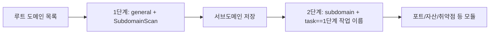

---

## name: scopesentry-mcp
description: ScopeSentry MCP로 보안 스캔 플랫폼(프로젝트, 작업, 템플릿, 자산, 노드)을 다룹니다. 사용자가 ScopeSentry, MCP, API Key, 스캔 작업, 자산 조회를 언급할 때 사용하세요.

# ScopeSentry MCP 사용 안내

**이미 배포된 ScopeSentry 인스턴스**를 쓰는 사용자를 위한 문서입니다. Cursor(또는 다른 MCP 클라이언트)로 플랫폼에 붙으며, 로컬에 소스를 둘 필요가 없습니다.

## 1. 준비

### 1.1 서비스 접근 확인

- 기본 웹 화면: `http://<호스트>`
- MCP 엔드포인트: `http://<호스트>/mcp` (앞에 리버스 프록시나 프런트엔드 프록시가 있으면 실제 `/mcp` 주소를 쓰세요)

### 1.2 API Key 만들기

1. 브라우저로 ScopeSentry 웹 화면에 로그인
2. **API Key** 관리 화면에서 키 생성(또는 관리자가 제공한 API로 생성)
3. 돌려받은 `ssk_...` 문자열을 저장(**한 번만 보여 줍니다**)

### 1.3 Cursor MCP 설정

Cursor → Settings → MCP → 서버 추가:

```json
{
  "mcpServers": {
    "scopesentry": {
      "url": "http://<당신의 호스트>:8082/mcp",
      "headers": {
        "X-API-Key": "ssk_당신의_키"
      }
    }
  }
}
```

`Authorization: Bearer ssk_당신의_키` 형태도 됩니다.

설정한 뒤 MCP를 재시작하거나 Cursor를 다시 읽어, 도구 목록에 `list_projects`, `list_assets` 등이 보이는지 확인하세요.

---

## 2. 도구 목록

| 도구 | 용도 |
| ---------------------- | ----------------- |
| `list_projects` | 태그로 묶인 프로젝트 트리(프로젝트 ID 포함) |
| `list_projects_data` | 페이지 단위 프로젝트 목록, 이름으로 검색 가능 |
| `get_project` | 프로젝트 상세 |
| `create_project` | 프로젝트 생성 |
| `list_tasks` | 스캔 작업 목록 |
| `get_task` | 작업 상세 |
| `list_scan_templates` | 스캔 템플릿 목록 |
| `get_scan_template` | 템플릿 상세 |
| `list_plugin_modules` | 스캔 파이프라인 모듈 이름 |
| `list_plugins` | 사용 가능한 플러그인(hash, 기본 파라미터 포함) |
| `create_scan_template` | 스캔 템플릿 생성 |
| `create_scan_task` | 스캔 작업 생성 |
| `list_assets` | 자산 조회(페이지 목록) |
| `count_assets` | 자산 개수 집계(`/api/assets/common/total`) |
| `get_asset_detail` | 자산 또는 취약점 상세 |
| `add_asset_tag` | 자산에 태그 추가 |
| `list_nodes` | 스캔 노드 목록 |

각 도구의 파라미터는 MCP 도구 설명(schema)이 기준입니다. `list_assets`와 `count_assets`의 search, filter 문법은 같으므로, 자산을 조회하기 전에 `list_assets` description을 먼저 읽어 두세요.

"전부 몇 건인가"가 필요할 때는 `count_assets`를 쓰세요(웹 화면의 페이지 총개수 API와 같습니다). 총개수를 세려고 `list_assets`로 페이지를 넘길 필요가 없습니다.

---

## 3. 자주 쓰는 흐름

### 3.1 프로젝트별 자산 조회

사용자나 맥락에 **이미 프로젝트 조건이 있으면** `filter.project`를 함께 넣어 범위를 좁히세요. 프로젝트를 넘나드는 데이터가 많으면 응답이 느려집니다. 프로젝트가 분명하지 않으면 굳이 넣지 않아도 됩니다.

1. `list_projects` 또는 `list_projects_data`로 대상 프로젝트의 **ObjectID**를 얻습니다(`id` / `children[].value`)
2. `list_assets`에 `filter.project`를 넣습니다(**ID여야 하며, 프로젝트 표시 이름은 안 됩니다**)

```json
{
  "asset_type": "asset",
  "pageIndex": 1,
  "pageSize": 20,
  "search": "domain=^example.com",
  "filter": {
    "project": ["<프로젝트ObjectID>"]
  }
}
```

### 3.2 스캔 작업 만들기

1. `list_nodes`로 온라인 노드 이름을 확인
2. `list_scan_templates` 또는 `create_scan_template`으로 템플릿 **ObjectID**를 확보
3. `create_scan_task`: `name`, `node`는 필수, `template`에는 템플릿 ID를 넣습니다(템플릿 이름은 안 됩니다)

**대상 출처 `targetSource`(웹 화면과 동일):**

| targetSource | 설명 | 필수 파라미터 |
| --- | --- | --- |
| `general` | 대상을 직접 입력 | `target` |
| `project` | 프로젝트에서 대상을 읽음 | `project`(프로젝트 ObjectID 배열) |
| `asset` | 웹 자산 저장소에서 검색 | `search`, 선택: `project`, `filter`, `targetNumber` |
| `RootDomain` | 루트 도메인 저장소에서 검색 | `search`, 선택: `project`, `filter`, `targetNumber` |
| `subdomain` | 서브도메인 저장소에서 검색 | `search`, 선택: `project`, `filter`, `targetNumber` |
| `UrlScan` | URL 스캔 결과에서 검색 | `search`, 선택: `project`, `filter`, `targetNumber` |
| `*Source`(예: `subdomainSource`) | 자산 화면의 「선택/검색」에서 생성 | `targetTp=search`면 `search`, `targetTp=select`면 `targetIds` |

**예시 — 루트 도메인을 바로 스캔:**

```json
{
  "name": "example-서브도메인수집",
  "node": ["node-1"],
  "template": "<템플릿ObjectID>",
  "targetSource": "general",
  "target": "example.com\nfoo.com",
  "project": ["<프로젝트ObjectID>"]
}
```

**예시 — 서브도메인 저장소에서 이어 스캔(이전 작업 이름으로 필터):**

```json
{
  "name": "example-포트와취약점",
  "node": ["node-1"],
  "template": "<후속 모듈 템플릿ObjectID>",
  "targetSource": "subdomain",
  "search": "task==\"example-서브도메인수집\"",
  "project": ["<프로젝트ObjectID>"]
}
```

### 3.3 루트 도메인 전체 정보 수집(2단계 권장)

입력이 **루트 도메인**이고 **전체 정보 수집**을 하려면, 파이프라인을 한 번에 돌리지 말고 두 번에 나누어 스캔하는 쪽을 권합니다.

**이유:** 분산 작업은 **대상 하나**를 단위로 나누어 보냅니다. 루트 도메인을 대상으로 주면 그 루트 도메인을 받은 노드에서 찾아낸 서브도메인까지 같은 노드에서 후속 모듈을 돌리게 되어, 부하가 한쪽으로 몰리고 느려지며 실패하기도 쉽습니다.

**권장 방법:**

1. **1단계 — 서브도메인 수집만**
   - `targetSource`: `general`
   - `target`: 루트 도메인 전체(여러 줄)
   - 템플릿: `SubdomainScan`, `SubdomainSecurity`만 사용(서브도메인 스캔 + 서브도메인 테이크오버)
   - `get_task`로 작업이 끝날 때까지 기다립니다

2. **2단계 — 후속 모듈**
   - `targetSource`: `subdomain`
   - `search`: `task=="<1단계 작업 이름>"`(작업 이름 정확히 일치)
   - 선택적으로 `project`로 범위를 좁힙니다
   - 템플릿: 포트 스캔, 자산 매핑, 취약점 스캔 등(SubdomainScan은 빼도 됩니다)
   - 서브도메인이 각각 독립된 대상으로 노드에 나뉘어 병렬 효율이 좋아집니다

웹 화면의 「서브도메인」 자산 페이지에서 작업 이름으로 걸러낸 뒤 「서브도메인으로 작업 생성」을 써도 결과는 같습니다.



### 3.4 스캔 템플릿 만들기

1. `list_plugin_modules` → 모듈 이름 목록
2. `list_plugins`(`module`로 필터 가능) → 각 플러그인의 `hash`와 기본 `parameter`
3. `create_scan_template`: `modules`에 「모듈 → 플러그인 hash 배열」을 지정

---

## 4. 자산 조회 (`list_assets` / `count_assets`)

`count_assets`는 `list_assets`와 같은 `asset_type`, `search`, `filter`를 받고 `{ "total": N }`을 돌려줍니다. 웹 화면의 `/api/assets/common/total`에 해당합니다.

```json
{
  "asset_type": "subdomain",
  "search": "task==\"어떤 작업 이름\"",
  "filter": {"project": ["<프로젝트ObjectID>"]}
}
```

**성능 참고(`list_assets` / `count_assets` 공통):** 프로젝트 조건이 있으면 `filter.project`로 먼저 범위를 좁히세요. `search`에서 인덱스가 있는 필드는 되도록 `==` 완전 일치나 `^` 접두사 일치를 쓰고([4.3](#43-search-검색-표현식) 참고), 넓은 범위에 `=` 부분 일치를 쓰지 마세요. 프로젝트 맥락이 없으면 굳이 프로젝트 조건을 넣지 않아도 됩니다.

`filter.project`를 지원하는 타입은 [4.4](#44-filter-정확-필터) 표를 보세요.

### 4.1 자산 타입 `asset_type`

`asset`, `RootDomain`, `subdomain`, `app`, `mp`, `UrlScan`, `SensitiveResult`, `DirScanResult`, `crawler`, `vulnerability`, `PageMonitoring`, `IPAsset`, `SubdomainTakerResult`

별칭 예: `web`→asset, `vuln`→vulnerability, `ip`→IPAsset, `url`→UrlScan

### 4.2 파라미터

| 파라미터 | 설명 |
| ------------------------ | --------------------------------------- |
| `pageIndex` / `pageSize` | 페이지, 기본 1 / 20 |
| `search` | 검색 표현식(아래 절 참고) |
| `filter` | 정확 필터 JSON(아래 절 참고) |
| `sort` | UrlScan, DirScanResult만 `length` 정렬 지원 |
| `sid` | SensitiveResult 전용: 민감정보 규칙 이름 |

`search`와 `filter`는 **함께 쓸 수 있습니다**.

### 4.3 search 검색 표현식

전용 DSL입니다(**SQL이 아닙니다**).

| 연산자 | 뜻 | 인덱스 | 예시 |
| ---- | ---- | ---- | --------------------------- |
| `=` | 부분 일치(regex) | 안 탐 | `domain=example` |
| `==` | 완전 일치 | **탐** | `port==443` |
| `!=` | 제외 | — | `port!="80"` |
| `&&` | AND | — | `domain==example.com && port==443` |
| `||` | OR | — | `title=admin || body=login` |

**인덱스와 연산자:** `domain`, `ip`, `port`, `title` 같은 필드에는 인덱스가 있지만, **`==` 완전 일치**이거나 **값이 `^`로 시작하는 접두사 일치**(예: `domain=^example.com`)일 때만 인덱스를 씁니다. **`=`는 regex 부분 일치로 바뀌어 인덱스를 쓰지 못하므로** 데이터가 많으면 느려집니다.

**모든 타입 공통 search 필드:** `tag`, `task`(작업 이름), `rootDomain`

**project는 search에 쓸 수 없습니다**(무시되거나 `&&`와 함께 쓰면 오류). 프로젝트로 거를 때는 `filter.project`를 쓰세요.

**타입별 주요 search 필드:**

| asset_type | 필드 |
| -------------------- | ----------------------------------------------------------------------------------- |
| asset | domain, ip, port, service, app, title, statuscode, icon, banner, type, body, header |
| RootDomain | domain, icp(= brn), company |
| subdomain | domain, ip, type, value |
| app | name, icp(= brn), company, category, description, url, apk |
| mp | name, icp(= brn), company, category, description, url |
| UrlScan | url, input, source, resultId, type |
| SensitiveResult | url, sname, body, info, md5 |
| DirScanResult | url, statuscode, redirect, length |
| vulnerability | url, vulname, matched, request, response, level |
| crawler | url, method, body, resultId |
| PageMonitoring | url, hash, diff, response |
| IPAsset | ip, domain, port, service, webServer, app |
| SubdomainTakerResult | domain, value, type, response |

`icp`와 `brn`은 같은 필드를 가리킵니다. 지역 프로필이 `KR`일 때 화면에서 라벨을 사업자등록번호로 보여 주는데, 검색어로는 둘 다 받습니다.

**search 예시:**

- `domain==www.example.com && port==443`(완전 일치, 인덱스 사용)
- `domain=^example.com`(접두사 일치, 인덱스 사용)
- `ip==192.168.1.1`
- `task=="어떤 작업 이름"`
- `level==high`(vulnerability)
- `statuscode==200`(DirScanResult)

부분 일치가 필요할 때만 `=`를 쓰세요(예: `title=admin`). 인덱스를 못 쓰므로 프로젝트 같은 조건과 함께 범위를 좁히는 편이 좋습니다.

### 4.4 filter 정확 필터

JSON 객체입니다. 같은 key의 여러 값은 **OR**, 다른 key끼리는 **AND**입니다.

**프로젝트 조건이 있으면 `project`를 우선:** 사용자나 맥락에 프로젝트가 분명하고 asset_type이 `project`를 지원하면, 범위를 좁히기 위해 함께 넣으세요. 프로젝트 정보가 없으면 굳이 넣지 않아도 됩니다.

| filter key | 뜻 | 값 설명 |
| ------------ | -------- | -------------------------------------------------------- |
| `project` | 소속 프로젝트 | **ObjectID**. `list_projects` / `list_projects_data`로 확인 |
| `task` | 출처 작업 | **작업 이름**. `list_tasks`의 `name` |
| `port` | 포트 | 예: `"443"` |
| `service` | 서비스/프로토콜 | 예: `"https"` |
| `app` | 애플리케이션 핑거프린트 | 예: `"Nginx"` |
| `icon` | 파비콘 hash | |
| `statuscode` | HTTP 상태 코드 | 주로 asset에서 사용 |
| `status` | 상태 | UrlScan/DirScan은 HTTP 코드, 취약점·민감정보는 처리 상태 |
| `level` | 취약점 등급 | critical / high / medium / low / info |
| `type` | 타입 | 예: 서브도메인 레코드 타입 A, CNAME |
| `color` | 민감정보 규칙 색상 | SensitiveResult |
| `sname` | 민감정보 규칙 이름 | SensitiveResult |
| `tags` | 태그 | |

**타입별 사용 가능한 filter key:**

| asset_type | filter key |
| ------------------------------------- | --------------------------------------------------------------- |
| asset | project, port, service, app, icon, statuscode, type, task, tags |
| RootDomain | project, tags |
| subdomain | project, type, task, tags |
| app / mp | project, tags |
| UrlScan | status, tags |
| DirScanResult | status, tags |
| SensitiveResult | status, color, sname, tags |
| crawler | project, task, tags |
| vulnerability | project, level, status, task, tags |
| PageMonitoring / SubdomainTakerResult | tags |
| IPAsset | project, port, service, app |

**filter 예시:**

```json
{"project": ["<프로젝트ObjectID>"], "port": ["443"]}
```

**조합 예시:**

```json
{
  "asset_type": "asset",
  "search": "domain=^example && port==443",
  "filter": {"project": ["<프로젝트ObjectID>"]},
  "pageIndex": 1,
  "pageSize": 10
}
```

**주의:**

- 프로젝트 조건이 있으면 `filter.project`를 우선 넣으세요(지원하는 타입에서). 프로젝트 맥락이 없으면 강제하지 않습니다
- `filter.project`에 프로젝트 표시 이름을 넣지 마세요
- 값을 알고 있으면 `==`, 접두사면 `^`를 쓰세요. 큰 컬렉션에 `=` 부분 일치를 남용하지 마세요
- UrlScan의 HTTP 상태는 `filter.status`를 쓰고, DirScanResult는 search에서 `statuscode==200`을 쓸 수 있습니다
- SensitiveResult를 규칙 이름으로 거를 때는 `search`에 `sname=규칙이름`을 쓰거나 `filter.sname`을 씁니다

### 4.5 정렬 sort

**UrlScan**, **DirScanResult**만 지원합니다.

```json
{"length": "ascending"}
```

다른 타입은 `sort`를 무시하고 시간순 기본 정렬을 씁니다.

---

## 5. 스캔 템플릿 모듈 이름

`TargetHandler`, `SubdomainScan`, `SubdomainSecurity`, `PortScanPreparation`, `PortScan`, `PortFingerprint`, `AssetMapping`, `AssetHandle`, `URLScan`, `WebCrawler`, `URLSecurity`, `DirScan`, `VulnerabilityScan`, `PassiveScan`

---

## 6. 문제 해결

| 증상 | 처리 |
| --------- | -------------------------------------------------- |
| MCP에 도구가 안 보임 | URL, API Key, ScopeSentry 실행 여부를 확인 |
| 401 / 403 | API Key를 다시 만들거나 교체 |
| 자산이 조회되지 않음 | `filter.project`가 ObjectID인지 확인. search에 project를 쓰지 말 것 |
| 템플릿/작업 생성 실패 | `template`은 템플릿 ObjectID여야 하고, `node`에는 온라인 노드 이름을 넣을 것 |
| 조회가 느리거나 멈춤 | 프로젝트가 있으면 `filter.project`를 추가. search에서 인덱스 있는 필드는 `==`나 `^` 접두사로 바꾸고 `=`를 줄일 것. `pageSize`를 줄일 것 |

---
